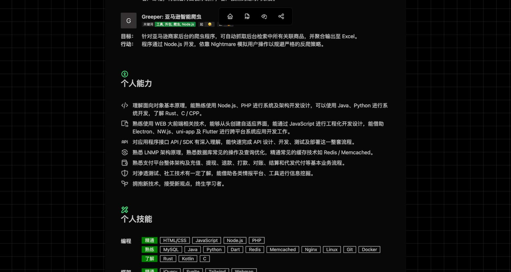
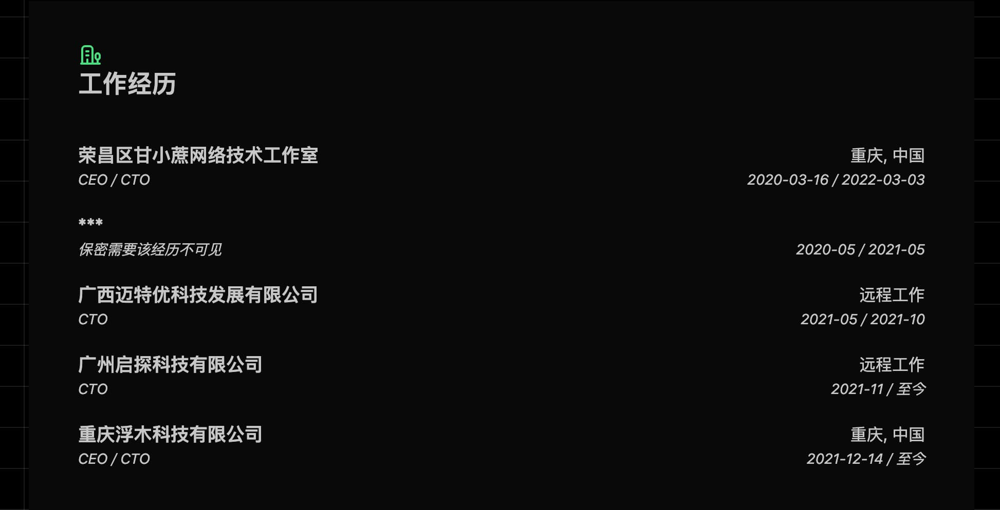
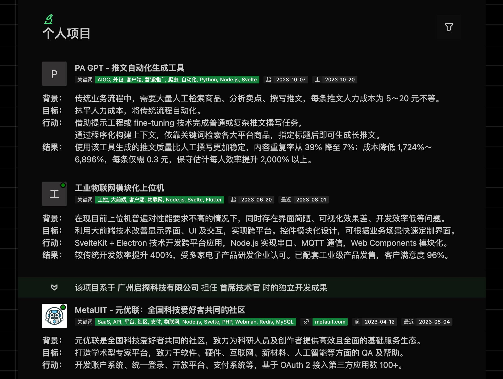
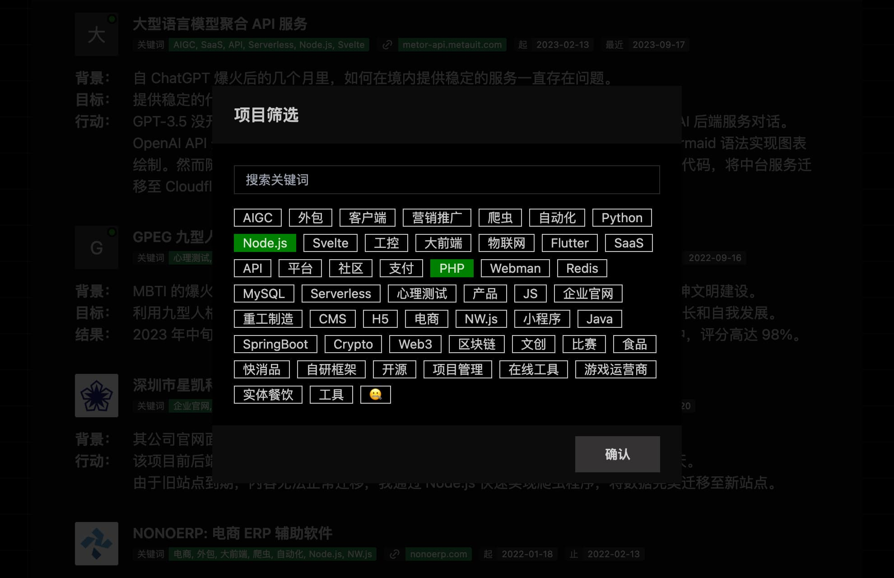
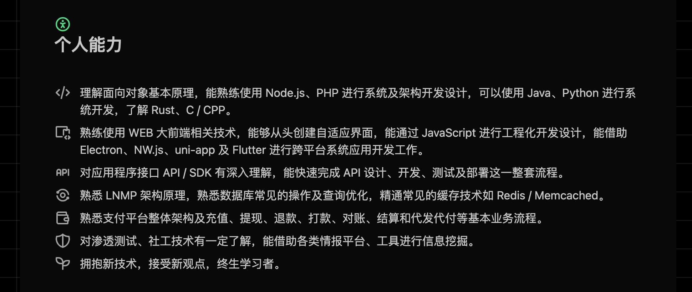
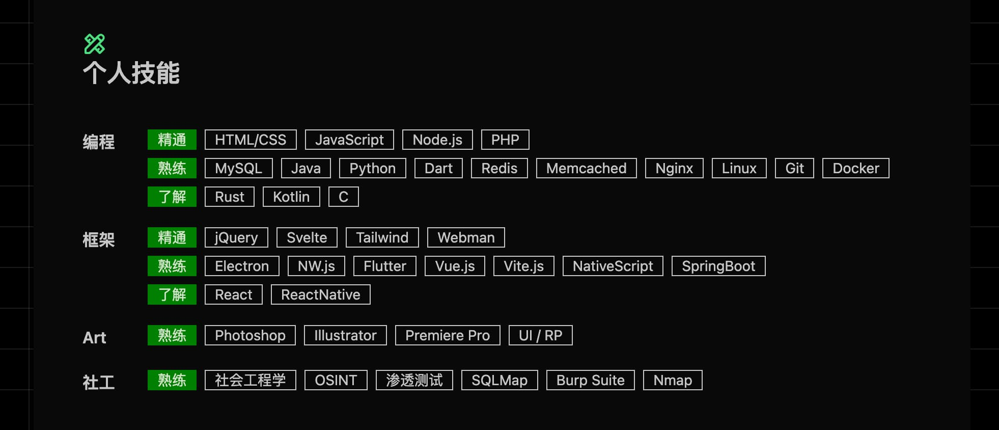
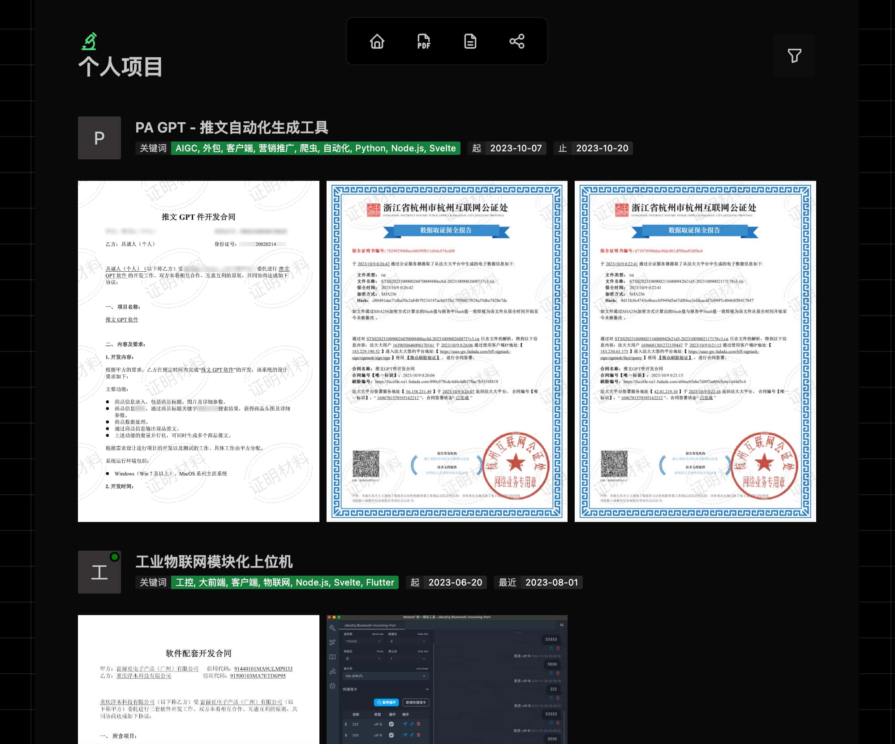

# AboutMe
基于 SvelteKit 构建的，适用于独立开发者的多功能自适应在线简历。

查看在线 Demo: [Cloudflare Pages](https://about.gxzv.com/resume?repo)

## 简历结构
### 简述

`/src/routes/+page.svelte`

手机号经过 `window.atob` 方法进行编码，非明文。实际分发链接时可以通过传参以明文显示，如：`resume?phone=18800000000`

### 工作经历

`/src/lib/data/EmploymentList.ts`

### 个人项目

`/src/lib/data/ProjectList.ts`

支持通过标签进行筛选：

### 个人能力

`/src/lib/modules/AbilityListView.svelte`

### 个人技能

`/src/lib/modules/SkillListView.svelte`

## 作证材料支持
